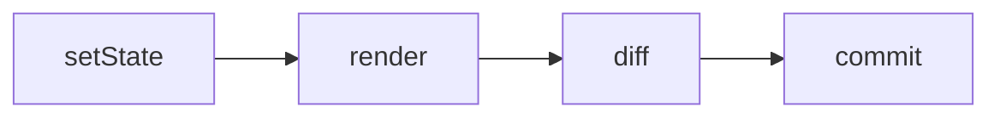

# React 렌더링 흐름

## 오늘의 목표

- 렌더 단계와 커밋 단계를 구분한다.
- 상태 업데이트가 렌더링을 예약하는 방식을 설명한다.
- 불필요한 렌더링을 관찰하는 방법을 확인한다.

## 핵심 흐름

```mermaid
flowchart LR
  A[setState] --> B[render]
  B --> C[diff]
  C --> D[commit]
```

Mermaid는 현재 정적 렌더러에서 다이어그램으로 실행하지 않는다. 발표 자료에서는 코드블록으로 안전하게 표시한다.

